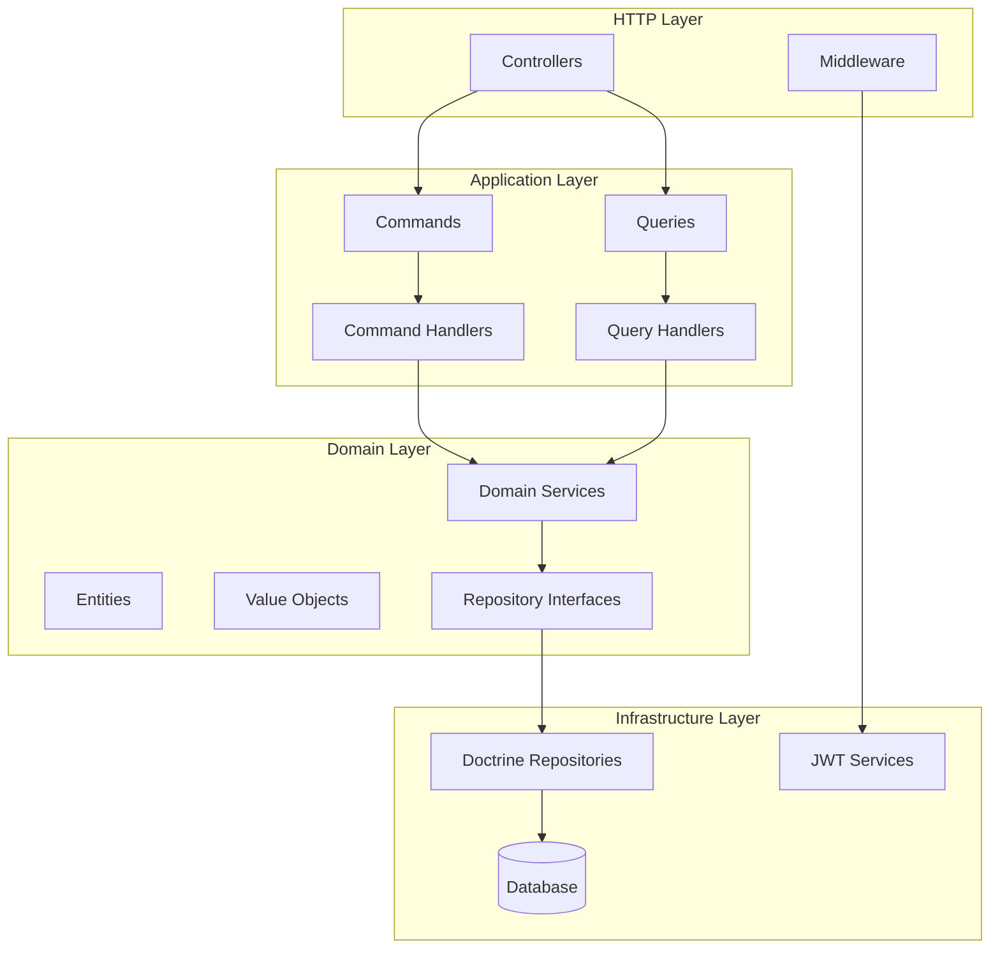

# Design Document

## Overview

The Dragon Ball API Phase 1 implements a REST API following Hexagonal Architecture, Domain-Driven Design (DDD), and Command Query Responsibility Segregation (CQRS) patterns. The system is organized into three bounded contexts: User, Character, and Planet, each containing domain logic, application services, and infrastructure adapters.

The architecture ensures clean separation of concerns with the domain layer containing pure business logic, the application layer orchestrating use cases through commands and queries, and the infrastructure layer handling external concerns like HTTP, database persistence, and JWT authentication.

## Architecture

### Hexagonal Architecture Layers



### Bounded Context Organization

The system is organized into three bounded contexts following DDD principles:

- **User Context**: Handles authentication, user registration, and JWT token management
- **Character Context**: Manages Dragon Ball character entities with CRUD operations and search
- **Planet Context**: Manages Dragon Ball planet entities with CRUD operations and search

Each context follows the same internal structure:
- `Domain/`: Pure business logic with entities, value objects, and repository interfaces
- `Application/`: Use case orchestration with commands, queries, and their handlers
- `Infrastructure/`: External adapters for HTTP, database, and framework integration

## Components and Interfaces

### User Context Components

#### Domain Layer
- **User Entity**: Core user aggregate with email, password, and timestamps
- **RefreshToken Entity**: Long-lived token for JWT renewal
- **UserRepositoryInterface**: Contract for user data access
- **RefreshTokenRepositoryInterface**: Contract for refresh token data access

#### Application Layer
- **RegisterUserCommand/Handler**: User registration use case
- **LoginUserCommand/Handler**: User authentication use case
- **RefreshTokenCommand/Handler**: JWT token renewal use case
- **ForgotPasswordCommand/Handler**: Password reset initiation use case

#### Infrastructure Layer
- **AuthController**: HTTP endpoints for authentication operations
- **UserRepository**: Doctrine implementation of user data access
- **RefreshTokenRepository**: Doctrine implementation of refresh token data access
- **JWTService**: JWT token generation and validation service

### Character Context Components

#### Domain Layer
- **Character Entity**: Core character aggregate with name, gender, race, group, description, image_url
- **CharacterRepositoryInterface**: Contract for character data access

#### Application Layer
- **CreateCharacterCommand/Handler**: Character creation use case
- **UpdateCharacterCommand/Handler**: Character modification use case
- **DeleteCharacterCommand/Handler**: Character removal use case
- **GetCharacterByIdQuery/Handler**: Single character retrieval use case
- **SearchCharactersQuery/Handler**: Character search and filtering use case

#### Infrastructure Layer
- **CharacterController**: HTTP endpoints for character operations
- **CharacterRepository**: Doctrine implementation of character data access

### Planet Context Components

#### Domain Layer
- **Planet Entity**: Core planet aggregate with name, status, description, image_url
- **PlanetRepositoryInterface**: Contract for planet data access

#### Application Layer
- **CreatePlanetCommand/Handler**: Planet creation use case
- **UpdatePlanetCommand/Handler**: Planet modification use case
- **DeletePlanetCommand/Handler**: Planet removal use case
- **GetPlanetByIdQuery/Handler**: Single planet retrieval use case
- **SearchPlanetsQuery/Handler**: Planet search and filtering use case

#### Infrastructure Layer
- **PlanetController**: HTTP endpoints for planet operations
- **PlanetRepository**: Doctrine implementation of planet data access

### Shared Components

#### Domain Layer
- **BaseEntity**: Abstract base class with UUID primary key and timestamps
- **DomainEventInterface**: Contract for domain events
- **CommandBusInterface**: Contract for command dispatching
- **QueryBusInterface**: Contract for query dispatching

#### Infrastructure Layer
- **ExceptionListener**: Global exception handling for consistent API responses
- **RateLimitingMiddleware**: Request rate limiting implementation
- **ValidationMiddleware**: Input validation middleware
- **CorsMiddleware**: Cross-origin resource sharing configuration

## Data Models

### User Entity
```php
class User extends BaseEntity
{
    private UuidInterface $id;
    private string $email;
    private string $password;
    private array $roles;
    private DateTimeImmutable $createdAt;
    private DateTimeImmutable $updatedAt;
}
```

### RefreshToken Entity
```php
class RefreshToken extends BaseEntity
{
    private UuidInterface $id;
    private string $token;
    private UuidInterface $userId;
    private DateTimeImmutable $expiresAt;
    private DateTimeImmutable $createdAt;
}
```

### Character Entity
```php
class Character extends BaseEntity
{
    private UuidInterface $id;
    private string $name;
    private string $gender;
    private string $race;
    private string $group;
    private ?string $description;
    private ?string $imageUrl;
    private DateTimeImmutable $createdAt;
    private DateTimeImmutable $updatedAt;
}
```

### Planet Entity
```php
class Planet extends BaseEntity
{
    private UuidInterface $id;
    private string $name;
    private string $status;
    private ?string $description;
    private ?string $imageUrl;
    private DateTimeImmutable $createdAt;
    private DateTimeImmutable $updatedAt;
}
```

### Database Schema Design

All entities use UUID v4 primary keys for security and distributed system compatibility. The schema includes proper indexing for search operations:

- **users**: Unique index on email, index on created_at
- **refresh_tokens**: Index on user_id, index on expires_at
- **characters**: Index on name, gender, race, group for search optimization
- **planets**: Index on name, status for search optimization

## Correctness Properties

*A property is a characteristic or behavior that should hold true across all valid executions of a system-essentially, a formal statement about what the system should do. Properties serve as the bridge between human-readable specifications and machine-verifiable correctness guarantees.*

Now I need to analyze the acceptance criteria to determine which ones can be tested as properties:

<function_calls>
<invoke name="prework">
<parameter name="featureName">dragon-ball-api-phase1

After reviewing the prework analysis, I need to perform property reflection to eliminate redundancy:

**Property Reflection:**
- Properties 1.2 and 2.1/2.2 overlap on token expiry times - can be combined into comprehensive token generation property
- Properties 3.1, 5.1, and 11.1 all test UUID primary keys - can be combined into single UUID invariant property
- Properties 3.5/3.7 and 5.5/5.7 test validation behavior - can be combined into comprehensive validation properties
- Properties 4.1-4.5 and 6.1-6.3 test search/filtering - can be combined into comprehensive search properties
- Properties 7.1-7.6 test HTTP response codes - can be combined into comprehensive HTTP response property
- Properties 12.1-12.6 test CQRS compliance - can be combined into comprehensive CQRS property

### Authentication Properties

**Property 1: User Registration with Encrypted Passwords**
*For any* valid user registration data, creating a user account should result in a persisted user with encrypted password and UUID primary key
**Validates: Requirements 1.1, 1.6**

**Property 2: JWT Token Generation with Correct Expiry**
*For any* valid login credentials, authentication should generate a JWT token with 15-minute expiry and refresh token with 7-day expiry
**Validates: Requirements 1.2, 2.1, 2.2**

**Property 3: Token Refresh Round Trip**
*For any* valid refresh token, using it to refresh should generate a new valid JWT and refresh token pair
**Validates: Requirements 1.3**

**Property 4: Password Reset Initiation**
*For any* existing user email, requesting password reset should initiate the password reset process
**Validates: Requirements 1.4**

**Property 5: Authentication Error Handling**
*For any* invalid credentials or expired tokens, the authentication system should return appropriate error responses
**Validates: Requirements 1.5, 2.3, 2.4**

**Property 6: Input Validation**
*For any* invalid email format or weak password, the authentication system should reject the input with validation errors
**Validates: Requirements 1.7**

**Property 7: JWT Security**
*For any* generated JWT token, it should use secure signing algorithms and be validated on all protected endpoints
**Validates: Requirements 2.5, 2.6**

### Entity Management Properties

**Property 8: UUID Primary Key Invariant**
*For any* created entity (User, Character, Planet), it should have a UUID primary key
**Validates: Requirements 3.1, 5.1, 11.1**

**Property 9: Character CRUD Operations**
*For any* character, CRUD operations (create, read, update, delete) should work correctly with proper persistence and retrieval
**Validates: Requirements 3.1, 3.2, 3.3, 3.4**

**Property 10: Planet CRUD Operations**
*For any* planet, CRUD operations (create, read, update, delete) should work correctly with proper persistence and retrieval
**Validates: Requirements 5.1, 5.2, 5.3, 5.4**

**Property 11: Character Validation**
*For any* character creation or update, required fields (name, gender, race, group) should be validated and optional fields (description, image_url) should be supported
**Validates: Requirements 3.5, 3.6, 3.7**

**Property 12: Planet Validation**
*For any* planet creation or update, required fields (name, status) should be validated and optional fields (description, image_url) should be supported
**Validates: Requirements 5.5, 5.6, 5.7**

### Search and Filtering Properties

**Property 13: Character Search and Filtering**
*For any* character search query with filters (name, gender, race, group), results should contain only characters matching all specified criteria
**Validates: Requirements 4.1, 4.2, 4.3, 4.4, 4.5**

**Property 14: Planet Search and Filtering**
*For any* planet search query with filters (name, status), results should contain only planets matching all specified criteria
**Validates: Requirements 6.1, 6.2, 6.3**

**Property 15: Pagination Limits**
*For any* search request, pagination should enforce default limit of 20 and maximum of 100
**Validates: Requirements 4.6, 6.4**

### API Response Properties

**Property 16: HTTP Response Codes**
*For any* API operation, the response should have the correct HTTP status code (200/201 for success, 401 for auth failure, 403 for authz failure, 404 for not found, 422 for validation failure, 429 for rate limiting, 500 for server error)
**Validates: Requirements 7.1, 7.2, 7.3, 7.4, 7.5, 7.6, 8.2**

**Property 17: JSON Response Format**
*For any* API response, it should be valid JSON with consistent structure
**Validates: Requirements 7.7**

### Security Properties

**Property 18: Rate Limiting**
*For any* authenticated user, requests should be limited to 100 per minute
**Validates: Requirements 8.1**

**Property 19: Authentication Protection**
*For any* protected endpoint access without authentication, the API should return HTTP 401
**Validates: Requirements 8.3**

**Property 20: Input Sanitization**
*For any* API input, malicious data should be validated and rejected to prevent injection attacks
**Validates: Requirements 8.4**

### Architecture Properties

**Property 21: Repository Pattern Compliance**
*For any* data access operation, repositories should implement domain interfaces, use Doctrine Query Builder, and handle transactions appropriately
**Validates: Requirements 11.2, 11.3, 11.4, 11.5, 11.6**

**Property 22: CQRS Pattern Compliance**
*For any* API operation, write operations should use Commands/CommandHandlers and read operations should use Queries/QueryHandlers, with controllers converting HTTP requests to Commands/Queries
**Validates: Requirements 12.1, 12.2, 12.3, 12.4, 12.5, 12.6**

**Property 23: Query Optimization**
*For any* database query, it should use proper indexing and avoid N+1 query problems
**Validates: Requirements 9.5**

### Documentation Properties

**Property 24: API Documentation Completeness**
*For any* API endpoint, it should be documented in OpenAPI/Swagger with request/response examples, authentication requirements, and error responses
**Validates: Requirements 10.2, 10.3, 10.4, 10.6**

## Error Handling

### Global Exception Handling Strategy

The system implements a centralized exception handling approach using Symfony's exception listener pattern:

#### Exception Types and HTTP Status Mapping
- **ValidationException**: HTTP 422 with detailed field-level errors
- **AuthenticationException**: HTTP 401 with generic authentication failure message
- **AuthorizationException**: HTTP 403 with access denied message
- **EntityNotFoundException**: HTTP 404 with resource not found message
- **RateLimitExceededException**: HTTP 429 with retry-after header
- **DomainException**: HTTP 400 with business rule violation message
- **InfrastructureException**: HTTP 500 with generic server error message

#### Error Response Format
All error responses follow a consistent JSON structure:
```json
{
  "error": {
    "code": "VALIDATION_FAILED",
    "message": "Validation failed",
    "details": {
      "field_name": ["Field is required", "Field must be valid email"]
    },
    "timestamp": "2024-01-15T10:30:00Z"
  }
}
```

#### Logging Strategy
- **Authentication failures**: Log with user identifier for security monitoring
- **Validation errors**: Log with sanitized input data for debugging
- **Server errors**: Log with full stack trace and request context
- **Rate limiting**: Log with user identifier and request count

### Domain-Specific Error Handling

#### User Context Errors
- **DuplicateEmailException**: When registering with existing email
- **InvalidCredentialsException**: When login credentials are incorrect
- **ExpiredTokenException**: When JWT or refresh token has expired
- **WeakPasswordException**: When password doesn't meet strength requirements

#### Character Context Errors
- **CharacterNotFoundException**: When character ID doesn't exist
- **InvalidCharacterDataException**: When character data fails validation
- **DuplicateCharacterNameException**: When character name already exists

#### Planet Context Errors
- **PlanetNotFoundException**: When planet ID doesn't exist
- **InvalidPlanetDataException**: When planet data fails validation
- **DuplicatePlanetNameException**: When planet name already exists

## Testing Strategy

### Dual Testing Approach

The system employs both unit testing and property-based testing to ensure comprehensive coverage:

#### Unit Testing
- **Purpose**: Verify specific examples, edge cases, and error conditions
- **Scope**: Individual components, integration points, and concrete scenarios
- **Framework**: PHPUnit 10+ with Symfony test framework integration
- **Coverage Target**: >70% for infrastructure layer, >90% for domain/application layers

#### Property-Based Testing
- **Purpose**: Verify universal properties across all valid inputs
- **Scope**: Business rules, invariants, and system-wide behaviors
- **Framework**: Eris (PHP property-based testing library)
- **Configuration**: Minimum 100 iterations per property test
- **Coverage**: All 24 correctness properties defined above

### Testing Configuration

#### Property-Based Test Setup
```php
use Eris\Generator;
use Eris\TestTrait;

class CharacterPropertyTest extends TestCase
{
    use TestTrait;
    
    /**
     * Feature: dragon-ball-api-phase1, Property 9: Character CRUD Operations
     */
    public function testCharacterCrudOperations()
    {
        $this->forAll(
            Generator\associative([
                'name' => Generator\string(),
                'gender' => Generator\elements(['male', 'female']),
                'race' => Generator\string(),
                'group' => Generator\string()
            ])
        )->then(function ($characterData) {
            // Test CRUD operations maintain consistency
            $character = $this->characterService->create($characterData);
            $retrieved = $this->characterService->getById($character->getId());
            $this->assertEquals($character->getName(), $retrieved->getName());
        });
    }
}
```

#### Unit Test Patterns
- **Controller Tests**: Mock application services, test HTTP request/response handling
- **Handler Tests**: Mock repositories, test business logic orchestration
- **Repository Tests**: Use test database, test data persistence and retrieval
- **Domain Tests**: Pure unit tests, no external dependencies

### Test Data Management

#### Fixtures and Factories
- **User Factory**: Generate valid users with encrypted passwords
- **Character Factory**: Generate characters with all required fields
- **Planet Factory**: Generate planets with valid status values
- **JWT Factory**: Generate valid and expired tokens for testing

#### Test Database Strategy
- **Separate test database**: Isolated from development data
- **Transaction rollback**: Each test runs in transaction, rolled back after completion
- **Seed data**: Minimal seed data for integration tests
- **Migration testing**: Verify database schema migrations work correctly

### Performance Testing Guidelines

While property-based and unit tests focus on correctness, performance requirements are validated through:
- **Load testing**: Separate test suite using Apache Bench or similar tools
- **Profiling**: Symfony profiler integration for development performance monitoring
- **Database query analysis**: Doctrine query logging and analysis
- **Memory usage monitoring**: PHP memory profiling for large datasets

The testing strategy ensures that both functional correctness (through properties and unit tests) and non-functional requirements (through performance testing) are validated throughout the development process.